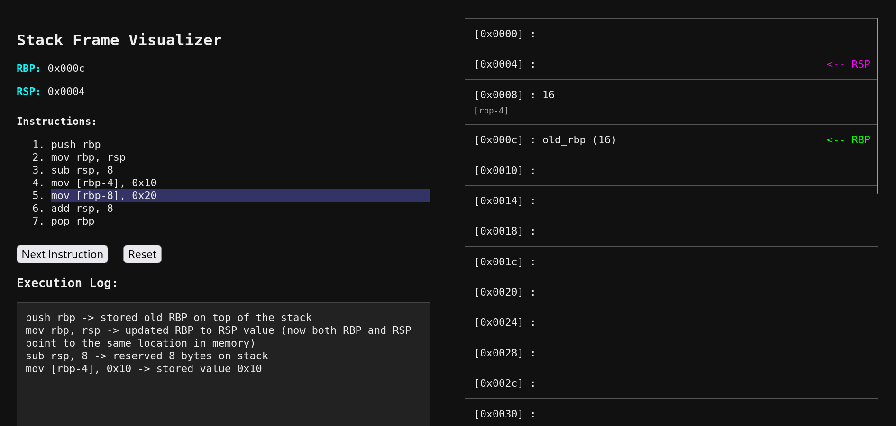

# stack-frame-visualizer
This is a simple web page that visually demonstrates how a stack frame is created and how memory is affected during its execution.


##  Installation & Usage

Follow these simple steps to run the Stack Frame Visualizer on your Linux system:

```bash
git clone https://github.com/rivian96/stack-frame-visualizer.git
cd stack-frame-visualizer
xdg-open stack-frame.html
```

